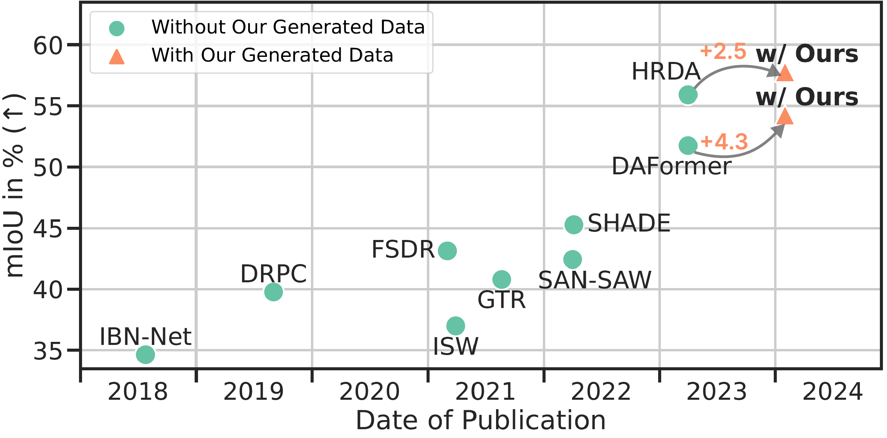

## :minidisc: DGInStyle-SegModel: Downstream Tasks Evaluation

This is the downstream tasks evaluation component of [DGInStyle](https://dginstyle.github.io/). The repository hosts implementations of the off-the-shelf semantic segmentation networks trained on datasets that utilize the [DGInStyle data generator](https://github.com/yurujaja/DGInStyle).


[[Project Page]](https://dginstyle.github.io/) | [[ArXiv]](https://arxiv.org/abs/2312.03048) |
[[Datasets]](https://drive.google.com/file/d/1e2wiwr5_wgCN3pLCQMOQvjRqQYtEozWy/view)

By [Yuru Jia](https://github.com/yurujaja),
[Lukas Hoyer](https://lhoyer.github.io/),
[Shengyu Huang](https://shengyuh.github.io/),
[Tianfu Wang](https://tianfwang.github.io/),
[Luc Van Gool](https://scholar.google.com/citations?user=TwMib_QAAAAJ&hl=en),
[Konrad Schindler](https://scholar.google.com/citations?user=FZuNgqIAAAAJ&hl=en),
[Anton Obukhov](https://www.obukhov.ai/)
 


## :gear: Setup Environments
For this project, we used python/3.8.5, cuda/11.0.3. 

### Repository
```bash
git clone https://github.com/yurujaja/DGInStyle-SegModel.git
cd DGInStyle-SegModel
```
### Dependencies
```bash
export SegModel_PATH=/path/to/venv/segmodel # change this
python3 -m venv ${SegModel_PATH}
source ${SegModel_PATH}/bin/activate

# use --ignore-installed to override pytorch installation
pip install --ignore-installed -r requirements.txt -f https://download.pytorch.org/whl/torch_stable.html
# requires the other packages to be installed first
pip install mmcv-full==1.3.7  
```

## :open_file_folder: Setup Datasets

In domain generalization scenario, semantic segmentation models are trained exclusively with synthetic datasets and tested on target (real-world) datasets.

### Synthetic Datasets: 
- **DGInStyle Datasets**: Please put the [DGInStyle produced dataset](https://github.com/yurujaja/DGInStyle) into `data/dginstyle_gen`. 
- **GTA**: Please download all image and label packages from here and extract them to `data/gta`. Then run the following scripts to generate rare classes related files and sample GTA subsets based on rare class sampling.
   ```   
   cd tools
   python convert_datasets/gta.py data/gta --nproc 8   # generate rare classes related files
   python rcs_sample_gta.py   # sample GTA subsets
   ```
### Real-World Datasets:

Only evaluation datasets are essential for the real-world datasets. 
- **Cityscapes**: Please download leftImg8bit_trainvaltest.zip and
gt_trainvaltest.zip from [here](https://www.cityscapes-dataset.com/downloads/)
and extract them to `data/cityscapes`.
- **BDD100K**: Please download the `10K Images` and `Segmentation` from
[here](https://bdd-data.berkeley.edu/portal.html#download) and extract it
to `data/bdd100k`.
- **Mapillary**: Please download the mapillary-vistas-dataset_public_v1.2.zip
from [here](https://www.mapillary.com/dataset/vistas) and extract it
to `data/mapillary`.
- **ACDC**: Please download rgb_anon_trainvaltest.zip and
gt_trainval.zip from [here](https://acdc.vision.ee.ethz.ch/download) and
extract them to `data/acdc`. Further, please restructure the folders from
`condition/split/sequence/` to `split/` using the following commands:

   ```shell
   rsync -a data/acdc/rgb_anon/*/val/*/* data/acdc/rgb_anon/val/
   rsync -a data/acdc/gt/*/val/*/*_labelTrainIds.png data/acdc/gt/val/
   ```
- **Dark Zurich**: Please download the Dark_Zurich_val_anon.zip from
[here](https://www.trace.ethz.ch/publications/2019/GCMA_UIoU/) and extract it
to `data/dark_zurich`.

## :balance_scale: Training
Use the following script to automatically generate and train the configs:
```shell
python run_experiments.py --exp <ID>
```
The training configs, logs and checkpoints are saved in `work_dirs/`. More information about the available experiments and their assigned IDs, can be found in [experiments.py](experiments.py).

## :hook: Testing & Predictions
To evaluate the model saved in `work_dirs/your_exp/`, run the following script:
```shell
sh test.sh work_dirs/your_exp/
```
To specify the dataset or visualizations, please refer to [tools/test.py](tools/test.py) for further instructions.

### Provided checkpoints
We provide the [checkpoints, training logs and evaluation files](https://huggingface.co/yurujaja/DGInStyle/tree/main/Segmentation_Models) for two DG models with MiT-B5 backbone: DAFormer and HRDA. 

## :shamrock: Acknowledgements

This repository is based on the following open-source projects. We thank their
authors for making the source code publicly available.

* [HRDA](https://github.com/lhoyer/HRDA)
* [DAFormer](https://github.com/lhoyer/DAFormer)
* [MMSegmentation](https://github.com/open-mmlab/mmsegmentation)
* [SegFormer](https://github.com/NVlabs/SegFormer)
* [DACS](https://github.com/vikolss/DACS)
* [SHADE](https://github.com/HeliosZhao/SHADE)

## :receipt: License

This project is released under the [Apache License 2.0](LICENSE), while some specific features in this repository are with other licenses. Please refer to [LICENSE](LICENSE) for the careful check, if you are using our code for commercial matters.

## :page_with_curl: Citation
```bibtex
@misc{jia2023dginstyle,
      title={DGInStyle: Domain-Generalizable Semantic Segmentation with Image Diffusion Models and Stylized Semantic Control}, 
      author={Yuru Jia, Lukas Hoyer, Shengyu Huang, Tianfu Wang, Luc Van Gool, Konrad Schindler, Anton Obukhov},
      year={2023},
      eprint={2312.03048},
      archivePrefix={arXiv},
      primaryClass={cs.CV}
}
```


